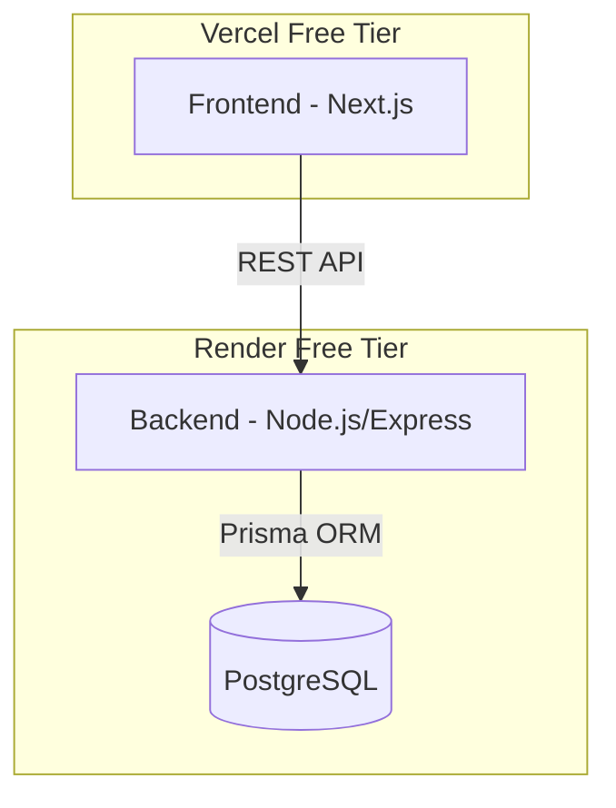

# 03 - Architecture

> **Two scopes, two diagrams.** This document describes what the hackathon MVP
> actually runs (1 Express process + 1 Postgres on free tiers). For the
> production-target design — sharded Postgres, Redis cluster, Kafka, K8s
> microservices, full observability — see **`docs/10-system-design.md`**.

## Topology (what we ship today)

## Component Choices
1. **Frontend (Next.js / Vercel):** Fast to set up, built-in API routes if needed (though I will use a separate backend), and Vercel's free tier is extremely reliable for live demos.
2. **Backend (Node.js/TypeScript / Render):** TypeScript ensures type safety for financial data. Express is lightweight. Render's free tier provides a genuine cloud environment.
3. **Database (PostgreSQL / Render):** Essential for demonstrating row-level locking (`SELECT ... FOR UPDATE`), which is a core requirement for safely building money movement apps. SQLite is insufficient as it lacks row-level locks.

## From MVP to Production

The MVP deliberately keeps wallet access behind a single `SELECT ... FOR UPDATE`
boundary so that promoting to a dedicated wallet service + shard layer later is
a refactor, not a rewrite. **`docs/10-system-design.md`** walks through that
migration end to end (capacity targets, layer-by-layer rationale, failure modes,
cost model).
