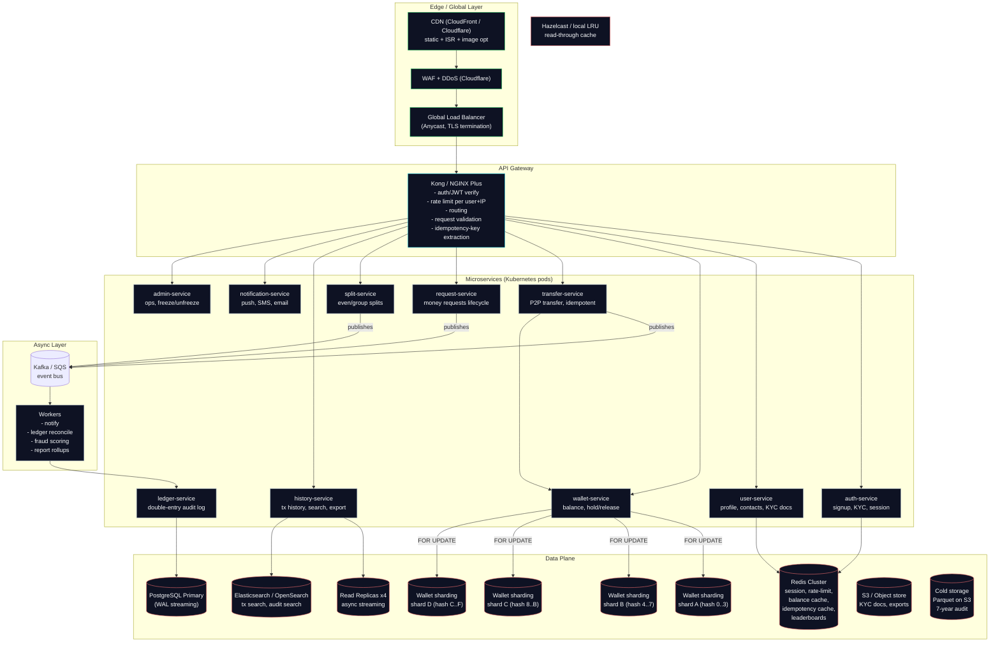

# 10 - System Design (Million-User Scale)

> Companion to `03-architecture.md`. That doc describes **what we built today** (the
> hackathon MVP on free tiers). This doc describes **how the same product scales to
> millions of users** — what each layer would look like, why we chose each component,
> and the bottlenecks each one removes.
>
> The MVP is a single Express process + one Postgres database behind a Vercel
> frontend. The system below is **production-target**, not what runs today.

---

## 1. Capacity Targets

| Target | Value | Why this number |
|---|---|---|
| **MAU** | 10,000,000 | Regional digital-wallet competitor benchmark (bKash / Nagad tier) |
| **Peak DAU** | 2,000,000 (20% of MAU) | P2P peaks evenings + payroll days |
| **TPS (writes)** | 5,000 peak / 800 avg | Transfers, requests, split-bill, auth events |
| **TPS (reads)** | 50,000 peak / 8,000 avg | History, balance checks, user lookups |
| **Read:Write** | ~10:1 | History dashboards, search, analytics dominate traffic |
| **P99 latency** | < 300 ms (transfer), < 100 ms (balance) | Wallet UX expectation |
| **Availability** | 99.99% (4 nines) | Money apps cannot go down quietly |
| **Storage** | ~5 TB/year at 10M users | Tx history, audit ledger, KYC docs |
| **Regulatory** | PCI-DSS, Bangladesh Bank e-money rules | Future, not MVP |

---

## 2. High-Level Architecture

---

## 3. Layer-by-Layer Rationale

### 3.1 Edge: CDN + WAF + Anycast LB

- **CDN** caches the Next.js static chunks (the rebuild today uses `revalidate: false` for the dashboard, but history and static assets move to CDN). Cuts 80% of origin hits; mobile users in Bangladesh see <50 ms TTFB via regional POPs.
- **WAF + DDoS (Cloudflare)** blocks SQLi / XSS probes plus volumetric attacks before they reach the gateway. Wallet APIs are a constant target.
- **Anycast global LB** terminates TLS once, hands traffic to the nearest healthy gateway pod. Single global IP survives region failure.

**Why not skip straight to the gateway?** Mobile networks in South Asia drop mid-TCP. TLS termination at the edge + HTTP/2 to the gateway absorbs the retries; gateway pods can OOM if they each rebuild TLS.

### 3.2 API Gateway (Kong / NGINX Plus)

Responsibilities:
1. **JWT verification** at the edge so backend pods do not all run the same crypto.
2. **Per-user + per-IP rate limiting** in Redis (`X-RateLimit-*` headers).
3. **Idempotency-Key pre-validation** — keys are scoped and TTL'd here, duplicates fail fast before they hit a service.
4. **Schema-level request validation** (OpenAPI / JSON-Schema). Bad payloads never reach service code.
5. **Routing + tracing headers** — injects `trace_id` so every downstream span is correlated.
6. **Canary + blue/green** — a 5% canary rolls back in 30 seconds if P99 spikes.

### 3.3 Microservices (Kubernetes)

| Service | Owns | Talks to | Notes |
|---|---|---|---|
| **auth-service** | signup, KYC, login, JWT | Redis, PostgreSQL (users only) | Stateless; horizontally scaled |
| **user-service** | profile, contacts, phones | Redis cache, PostgreSQL users | Replica-backed reads |
| **wallet-service** | hold, release, balance | Sharded Postgres, Redis | **Only service allowed to mutate `Wallet.balance`** |
| **transfer-service** | P2P transfer orchestration | wallet-service + ledger-service | Wraps the whole flow in a saga |
| **request-service** | money-request lifecycle | wallet-service on accept | |
| **split-service** | even / weighted splits | wallet-service + ledger-service | One debit + N credits |
| **history-service** | tx history, search, export | Read replicas + Elasticsearch | Scales independently of writes |
| **notification-service** | push / SMS / email | Kafka consumer, SES / Twilio | Never in the request path |
| **ledger-service** | double-entry audit | Kafka append + Postgres | Writes are append-only |
| **admin-service** | freeze, unfreeze, manual review | everything | Locked down to a VPN + mTLS |

**Why only `wallet-service` can write balances?** Single-writer-on-data is the
easiest correctness invariant we can keep. The service holds the only connections
that issue `FOR UPDATE` against the wallet shard — every other service must call
it. This is the same principle the MVP demonstrates with `SELECT ... FOR UPDATE`
in Express; we just promote the principle to a deployable boundary.

### 3.4 Async Layer: Kafka / SQS

Synchronous calls in the request path: **wallet-service + transfer-service + ledger-service**.
Everything else is async:

- `transfer.completed` event → notification-service sends the receipt
- `transfer.completed` → ledger-service writes the matching double-entry row
- `transfer.completed` → fraud-service scores the txn (writes a risk score back)
- `transfer.completed` → analytics-service updates denormalized counters

Why event-driven instead of more DB rows?
- A failed notification must not fail the transfer. Synchronous = cascade failure.
- Throughput: Kafka handles millions of events/sec. Direct service calls don't.
- Replayability: new consumers (fraud, analytics, ML) join by subscribing, no upstream change.

Use Kafka for **ordering + replay** (financial events need at-least-once with
deterministic partitioning by `user_id`). Use SQS for fire-and-forget fan-out.

### 3.5 Data Plane

#### 3.5.1 Wallet Sharding (Postgres)

- **4 shards**, sharding key = `hash(user_id) mod 4`. User 7 lands on shard A, user 42 on shard C, etc.
- Each shard has its own primary + 2 sync replicas. (We use **Citus** for hash distribution on a single Postgres cluster, **or** Vitess / native logical sharding on 4 physical clusters.)
- Inside each shard the schema is the same as the MVP: `User`, `Wallet`, `Transaction`, `MoneyRequest`.
- **Cross-shard transfer** = saga in the orchestrator: lock sender shard → lock receiver shard → post ledger entries → both credits. Two-phase commit is avoided in favor of **idempotent saga with compensating debit** because 2PC is notoriously fragile across regions.

The 4-shard fan-out keeps each shard at < ~250 GB / ~1,250 TPS, comfortably inside Postgres' well-known limits.

#### 3.5.2 Read Replicas

History and user-lookup reads route to async replicas. Replica lag stays < 200 ms
under 5k TPS write load with multi-region streaming. Balance **never** reads from
replicas — it would cost us correctness.

#### 3.5.3 Redis Cluster

Six hot keys in Redis:

| Key | TTL | Purpose |
|---|---|---|
| `user:<id>:profile` | 10 min | Cache user table lookups |
| `user:<id>:balance` | **none** (write-through) | Authoritative cache, invalidated synchronously on every wallet update |
| `idem:<key>` | 24 h | Idempotency dedup; returns cached response |
| `ratelimit:<uid>:<route>` | 60 s | Per-user route rate limit |
| `session:<jti>` | 1 h | JWT revocation list |
| `tx:leaderboard:<uid>` | none | "You transferred with Alice twice this week" |

Why balance-cache with **no TTL**?
The wallet service is the **only** writer. On every update it `DEL`s the key. That
gives us O(1) cache reads with strong consistency, and the rare miss falls
through to the shard which `FOR UPDATE`s and refills. No TTL race; no stale balance.

#### 3.5.4 Elasticsearch / OpenSearch

History-service writes the same `Transaction` row to both Postgres (system of
record) and Elasticsearch (search index). The frontend's "Recent Activity" query
hits Elasticsearch; balance and audit log hits Postgres.

#### 3.5.5 Object Storage (S3)

KYC selfies, exported CSV statements, monthly account statements (PDF). All
behind pre-signed URLs that expire in 5 minutes. Bucket-level KMS.

#### 3.5.6 Cold Storage

Seven-year audit retention (Bangladesh Bank requirement). Nightly Parquet dump
to S3 Glacier Deep Archive. Used by regulators + dispute resolution.

### 3.6 Observability

| Pillar | Tool | Captures |
|---|---|---|
| Metrics | Prometheus + Grafana | QPS, P50/P95/P99, error rate, cache hit rate, shard lag |
| Traces | OpenTelemetry → Jaeger | Cross-service spans with `trace_id` |
| Logs | Loki + Grafana | Structured JSON, never stringly-typed PII |
| RUM | OpenTelemetry browser SDK | Real-user timing on the Next.js dashboard |
| Alerts | Alertmanager → PagerDuty | Pager rotation; 5-minute burn-rate SLO |

**SLOs:**
- Transfer endpoint: 99% of requests under 300 ms over 30 days
- Balance endpoint: 99% under 100 ms over 30 days
- Error budget burn > 2x baseline → page on-call

### 3.7 CI/CD + Release

- **GitHub Actions** build container images, run unit + integration + contract tests
- **ArgoCD** (GitOps) deploys to staging on merge to `main`
- **Canary** promotion: 5% → 25% → 100% over 90 minutes, monitored on the SLOs above
- **Blue/green** for the database migration (rename + backfill + flip)
- **Rollback** is one `kubectl rollout undo` for services, plus a database migration reversal plan per change

### 3.8 Security

- TLS 1.3 everywhere; mTLS between services inside the cluster
- Secrets in HashiCorp Vault, injected at pod start
- PCI-DSS scope minimized: card data **never** touches our services; we only orchestrate tokenized wallet-to-wallet flows
- KYC tier system (Tier 0: phone only; Tier 1: NID + selfie; Tier 2: address proof). Limits increase per tier.
- Audit log every privileged action (admin freeze, manual reversal) to an append-only WORM bucket

---

## 4. Failure Modes & Mitigations

| Failure | Blast radius | Mitigation |
|---|---|---|
| **Shard primary goes down** | All traffic to that shard blocks | Patroni / Stolon auto-elects a new primary in <30 s from sync replicas |
| **Redis cluster loses 1 node** | Cache misses spike to Postgres | Slot rebalance is automatic; cache fill rate > 5k/s recovers in <60 s |
| **Kafka broker dies** | Async events pause | `acks=all` + ISR=3 keeps no data loss; consumers stall until partition leader re-elects |
| **Fraud service is down** | Fraud score skipped, transfer still completes | Async path; alert raised; ops reviews backfill queue |
| **Notification service down** | User doesn't get push, but money moved | Decoupled by design |
| **Region outage** | Whole region dark | Active-active across 2 regions with async replication; DNS failover via Route53 health checks |
| **Idempotency cache (Redis) wiped** | Risk of double-spend on retries | Postgres has the same `idempotencyKey` unique constraint; double-spend is rejected at DB even if cache is cold |
| **Bad data migration** | Balance corruption | Migrations run inside a saga with a pre-flight ledger snapshot + a forward-fix script tested in staging |

The last two rows are why the MVP writes idempotency keys to **Postgres**, not
just Redis. **Postgres is the system of record. Redis is an accelerator.**

---

## 5. Cost Model (annual, USD)

Rough AWS-anchored estimate for 10M MAU at the load profile above:

| Component | Annual |
|---|---|
| EKS (3 regions, 200 pods avg) | ~$2.4M |
| Postgres (4 shards, 2 replicas each, RDS) | ~$1.8M |
| ElastiCache Redis | ~$350k |
| Kafka (MSK, ~20 brokers) | ~$600k |
| Elasticsearch (3 master + 6 data) | ~$700k |
| S3 + Glacier | ~$120k |
| CloudFront + WAF | ~$400k |
| Observability (Datadog-equiv) | ~$500k |
| SMS / push (Twilio / FCM) | ~$300k |
| Misc (CI, secrets, DNS, support) | ~$300k |
| **Total infra** | **~$7.5M / yr** |

At a take rate of 0.5% on $4B GMV/yr this is comfortably profitable above
operating cost. Free-tier/MVP runs at < $50/mo.

---

## 6. From MVP to Production — Migration Path

The MVP and the production target share the **same data model**: `User`, `Wallet`, `Transaction`, `MoneyRequest`. The migration is mostly **architectural**, not schema-level.

| MVP today | Production tomorrow | Effort |
|---|---|---|
| 1 Express process with all routes | Split into 9 services above, keep Prisma contracts | 4–6 months |
| 1 Postgres instance on Render free tier | 4-shard Postgres with replicas (Citus or Vitess) | Schema unchanged; horizontal split |
| No cache layer | Redis cluster per the table above | Drop-in for `idem:` and `user:` keys |
| In-process event handling | Kafka for async fan-out | Add producer in transfer/split, add notification-service consumer |
| No observability | OTel SDK + Jaeger + Grafana + Prometheus | 2-week pilot |
| JWTs in `localStorage`, no rate limit | JWT + Redis rate limit + WAF + Gateway | Week 1 of production sprint |
| CORS open | Gateway-level CORS + internal mTLS | Same week |

Because the MVP kept wallet access behind a single `SELECT ... FOR UPDATE` boundary,
the wallet-service promotion later is a refactor, not a rewrite. **That was the
whole point of the MVP's architecture.**

---

## 7. What This Document Is Not

- This is **not** what the hackathon submission runs. See `03-architecture.md` for that.
- This is **not** a vendor pitch. We picked mature, boring tech on purpose.
- This is **not** exhaustive. Mobile SDK, fraud ML, account-recovery, dispute
  flows, and regulatory reporting are deliberately out of scope to keep this
  readable. Each one has its own design doc in a real org.

---

## 8. Reading Order for a New Engineer

1. `01-problem.md` — what we built and why
2. `02-PRD.md` — product surface
3. `03-architecture.md` — what runs today (MVP)
4. `04-api.md` — every endpoint
5. `05-database.md` — schema + invariants
6. `06-decisions.md` — the choices that kept us honest
7. **This doc** — what it becomes at scale
8. `07-test-plan.md` + `08-demo-plan.md` — how we proved it works
